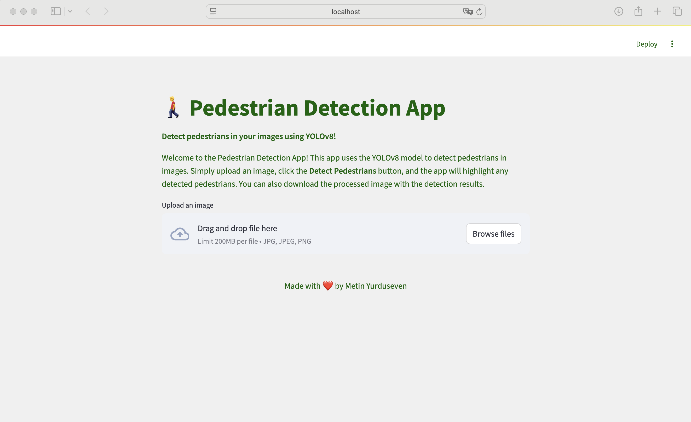
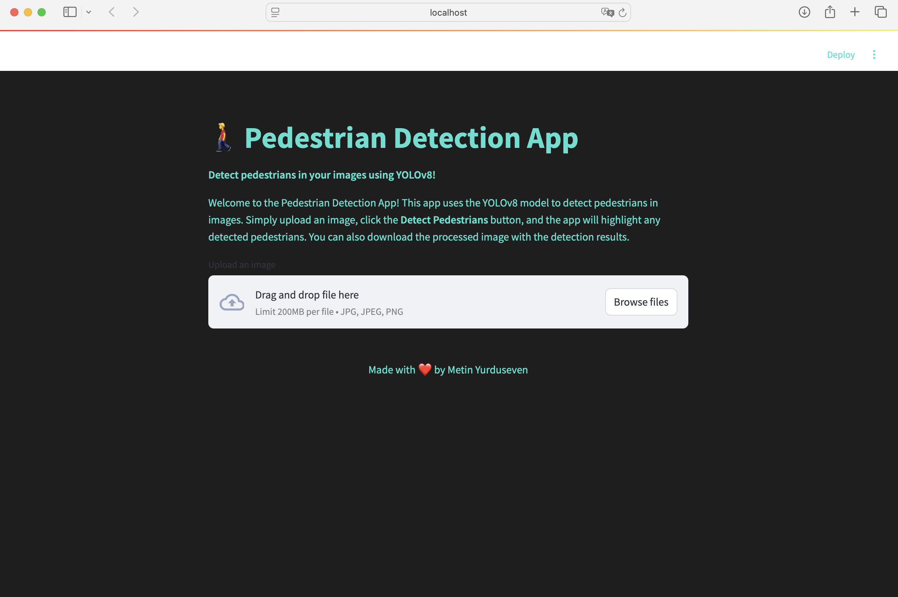
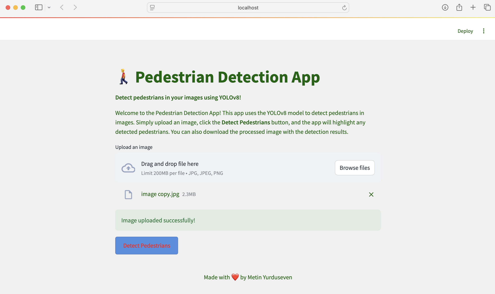
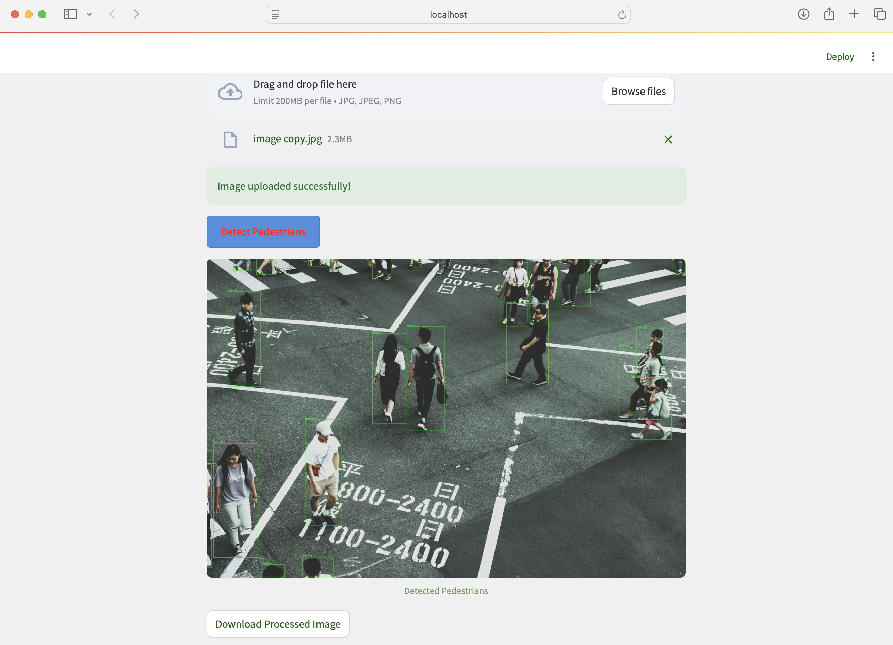

# 🚶‍♂️ Pedestrian Detection with YOLOv8

   

This project is designed to detect pedestrians using **YOLOv8** in both images and videos. It consists of two main components:

1. **`main.py`** - Detect pedestrians from images and videos.
2. **`app.py`** - A **Streamlit** web application for pedestrian detection from images.

---

## 📂 Project Structure
```
📁 Pedestrian-Detection
│-- 📁 images/                # Folder for images
│-- 📁 videos/                # Folder for videos
│-- 📁 mynewenv/              # Virtual environment
│-- 📝 requirements.txt       # Dependencies
│-- 🏗 yolov8m.pt            # YOLOv8 model weights
│-- 🖼 app.py                 # Streamlit App for image detection
│-- 🎥 main.py                # Script for video/image detection
```

---

## 🛠 Technologies Used
- **[Python 3.10](https://www.python.org/)** 🐍
- **[YOLOv8](https://github.com/ultralytics/ultralytics)** 🏎️
- **[OpenCV](https://opencv.org/)** 📷
- **[Torch](https://pytorch.org/)** 🔥
- **[Streamlit](https://streamlit.io/)** 🌐
- **[Pillow](https://pillow.readthedocs.io/)** 🖼

---

## 🚀 Installation

1️⃣ Clone the repository:
```bash
$ git clone https://github.com/metinyurdev/pedestrian-detection-with-yolov8.git
$ cd pedestrian-detection
```

2️⃣ Create a virtual environment and activate it:
```bash
$ python -m venv mynewenv
$ source mynewenv/bin/activate  # On macOS/Linux
$ mynewenv\Scripts\activate     # On Windows
```

3️⃣ Install dependencies:
```bash
$ pip install -r requirements.txt
```

---

## 🎥 Run Pedestrian Detection on Video
To detect pedestrians in a **video**, run the following command:
```bash
$ python main.py
```
Make sure you have a video file named `video.mp4` in the project directory.

---

## 🖼 Run Pedestrian Detection on Images (GUI with Streamlit)
To launch the **Streamlit** web application:
```bash
$ streamlit run app.py
```


[](project_photo/photo1.png)

[](project_photo/photo2.png)

[](project_photo/photo3.png)

[](project_photo/photo4.png)

---

## 📜 Requirements
The project requires the following dependencies (already included in `requirements.txt`):
```
ultralytics
opencv-python
torch
torchvision
matplotlib
numpy
pillow
streamlit
```

---

## 🎯 Features
✔️ **Real-time pedestrian detection** in images and videos.   
✔️ **Fast and efficient YOLOv8** inference.   
✔️ **Web interface** for image-based detection using Streamlit.   
✔️ **CUDA acceleration** for GPU users.   
✔️ **Simple and easy-to-use** interface.   

---

## 👨‍💻 Author
**Metin Yurduseven**  
🔗 [GitHub](https://github.com/metinyurdev)  
📧 metin.yurduseven@gmail.com

---

## 📜 License
This project is **MIT Licensed**. Feel free to use and modify it! 🎉

